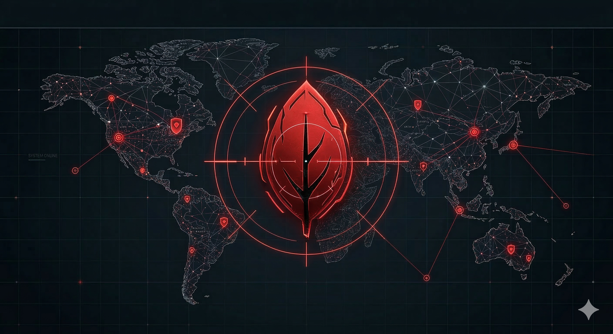
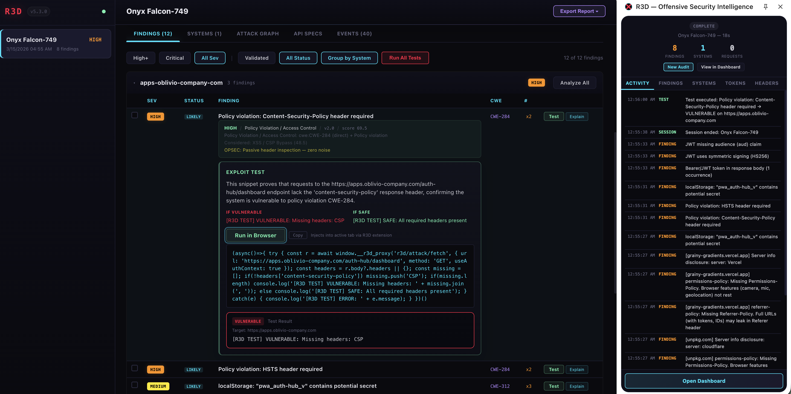

# R3D



Offensive security intelligence for internal web applications. Chrome extension + proxy server that intercepts live browser traffic, maps attack surfaces, generates and executes exploit tests against target pages, clones authenticated sites into credential-harvesting phish pages, replays stolen credentials server-side, runs AI-generated multi-step attack plans, tests lateral movement across systems, fuzzes endpoints with payload libraries, builds directed attack graphs with BFS pathfinding — and routes everything through LLMs for triage, system profiling, and attack chain analysis. All session data persists in MongoDB with client-side field-level encryption protecting captured credentials.

Built for systems behind SSO, Okta, and corporate auth — where the browser is already authenticated and the work is proving what that access can reach.



## What It Does

| Capability | How |
|------------|-----|
| **Passive analysis** | 16 detection modules run against every intercepted request: JWT weakness, PII exposure, IDOR patterns, CORS misconfiguration, CSP violations, insecure cookies, header auditing, RBAC analysis, system fingerprinting, pattern detection, SSRF/open redirect/GraphQL/rate-limit checks |
| **Active exploit testing** | Dashboard asks an LLM to generate browser-injectable exploit snippets matched to CWE-specific strategy templates. The extension injects them into the target page (`MAIN` world) with full access to cookies, localStorage, and session context. Results stream back via SSE. |
| **Phishing site cloner + MFA relay** | One-click clone of any authenticated page from the active browser tab. The proxy fetches the real page with captured auth context, rewrites all asset URLs, and injects SPA-aware credential capture hooks — form submit interception, password field blur listeners, fetch/XHR body intercept, MutationObserver for dynamically added forms, MFA/OTP field detection, and post-interaction cookie/storage snapshots. Victim-facing URL at `/p/{id}/`. When relay is armed, captured credentials are automatically replayed against the real login endpoint; MFA codes are intercepted and forwarded in real-time; resulting session cookies are stored in auth contexts for server-side replay — live session hijack. |
| **DOM XSS scanner** | Active client-side XSS detection triggered from the extension. Injects a scanner into the active tab that enumerates URL parameter sources, traces reflections through the live DOM into dangerous sinks (innerHTML, event handlers, script blocks, javascript: URIs), detects DOM clobbering vectors, flags unsafe postMessage handlers, and identifies source-to-sink data flows from page-world hook logs. Results become findings with severity ratings and remediation guidance. |
| **System deep-dive modal** | Full-screen operations modal for any target system. Click any system name in the dashboard to see: overview with severity breakdown and stats, all findings with per-finding actions, discovered endpoints grouped by path pattern, live security header scorecard and CORS audit, and an attack surface view with auth context inspection, quick-action buttons, and observed URLs. |
| **AI attack planner** | LLM generates multi-step attack plans that chain browser injection, server-side credential replay, and phishing clones across systems. The `"phish"` step type uses fixed server-side templates — zero LLM-generated JavaScript for the injection mechanics. Plans execute automatically with step-by-step SSE progress and AI-generated verdicts. |
| **Credential pivot engine** | AI-targeted lateral movement testing. Replays captured credentials from one system against other systems in the engagement to confirm cross-system access. Results update the attack graph with confirmed/rejected edges. |
| **Credential replay** | Extension periodically pushes auth context (HttpOnly cookies via Debugger API, Authorization headers, CSRF tokens) to the proxy. Server-side attack helpers replay those credentials against targets — bypassing CSP, CORS, and firewall restrictions the browser would enforce. |
| **Server-side attack helpers** | `POST /r3d/attack/fetch` (authenticated fetch), `/attack/validate-token` (trade stolen tokens for user identity via `/userinfo`), `/attack/test-redirect` (follow redirect chains), `/attack/exchange-code` (OAuth code-to-token exchange to prove missing PKCE) |
| **Scan & fuzz engine** | Probe orchestrator sends authenticated requests to target endpoints. Parameter fuzzer mutates inputs with built-in payload libraries (SQLi, XSS, SSRF, path traversal, command injection, IDOR) and detects anomalies by diffing against baseline responses. |
| **Attack graph** | Builds a directed graph of systems, vulnerabilities, and credentials from session data. BFS pathfinding between entry points and crown jewels. AI enrichment adds inferred lateral movement edges and exploitation instructions. |
| **OpenAPI spec import** | Import Swagger/OpenAPI specs by URL or file upload. Auto-flags sensitive endpoints (IDOR candidates, SSRF candidates, sensitive params). Diff coverage against observed traffic. Auto-generate scan probes from untested endpoints. |
| **Tool integration** | Import/export Burp Suite XML. Run Nuclei scans and import results. Export findings as SARIF 2.1.0. |
| **AI analysis** | LLM-driven system profiling, red team engagement verdicts, attack chain mapping, executive briefings, finding triage, and graph enrichment — all via `response_format: json_object` straight into MongoDB. |
| **One-click proof pages** | Shareable HTML proof pages for security headers, CORS misconfig, open redirects, and raw responses — generated server-side with replayed auth context. |
| **Multi-user auth** | JWT-based authentication with role-based access control (admin, operator, viewer). Supports API key, cookie, and Bearer token auth. |
| **OPSEC profiles** | User-Agent rotation, outbound header sanitization, and request throttling for stealth during engagements. |
| **Report generation** | PDF and HTML reports generated from session data with WeasyPrint — findings, system summaries, risk scores, and remediation guidance. |
| **Audit logging** | Tracks authentication events and administrative actions with timestamps for compliance. |
| **Queryable Encryption (CSFLE)** | R3D captures live weaponized material every session: HttpOnly cookies via the Debugger API, Bearer tokens from Authorization headers, OAuth access/refresh tokens from localStorage, CSRF tokens, and full request/response bodies from internal APIs containing PII, employee records, and org data. A stolen `okta-token-storage` JWT that validates is a working session hijack. A credential pivot proving an HR cookie also authenticates to payroll is a lateral movement proof. **CSFLE encrypts all of this client-side before it reaches the database.** The MongoDB server stores and indexes ciphertext — a DBA with `root` access sees `Binary(6, "AQFk...")`, not `{"Cookie": "sid=eyJhbG..."}`. Keys never touch the server. Local dev uses a 96-byte master key in `docker-compose.yml`; production deployments use AWS KMS / Azure Key Vault / GCP KMS. Key vault, data encryption key, and encrypted `r3d_credentials` collection bootstrap automatically on `docker compose up`. |
| **Webhooks** | Register webhook URLs for event notifications (session end, critical findings). |
| **Real-time dashboard** | Web UI at `localhost:4000` with SSE-powered live updates, session browsing, per-system analysis, test execution, attack graph visualization, phish site management, and spec coverage views. |

## Why CSFLE Is Non-Negotiable

Every R3D session captures data that would be catastrophic in the wrong hands: live session tokens, authentication cookies, OAuth credentials, exploit test results confirming which tokens grant access to which internal systems, and AI-generated attack chains showing exactly how to pivot between them. This isn't abstract telemetry — it's weaponized proof-of-access to corporate infrastructure.

Without field-level encryption, anyone with database access — a misconfigured network, a compromised backup, an insider with a connection string, a supply chain breach — gets every credential from every engagement in plaintext. The security tool becomes the highest-value target.

CSFLE eliminates this class of risk entirely. The credentials are encrypted at the application boundary using AES-256-CBC. The network sees ciphertext. The disk stores ciphertext. The backups contain ciphertext. The DBA sees ciphertext. Only the R3D proxy process holding the decryption key can read the actual tokens. One architectural decision removes an entire category of data exposure.

For the full technical breakdown of R3D's encryption architecture and why it matters, see [blog.md](blog.md).

## Project Structure

| Path | Description |
|------|-------------|
| [`r3d-extension/`](r3d-extension/README.md) | Chrome Manifest V3 extension — traffic interception, 16 analysis modules, test execution engine, auth context capture, side panel UI |
| [`r3d-proxy/`](r3d-proxy/README.md) | FastAPI backend — MongoDB session persistence, LiteLLM routing, attack helpers, scan/fuzz engine, attack graph builder, phishing cloner, attack planner, OpenAPI spec import, Burp/Nuclei integration, SARIF export, webhooks, web dashboard |
| `r3d-proxy/routers/` | 17 route modules: `attacks.py`, `auth.py`, `auth_context.py`, `dashboard.py`, `graphs.py`, `llm.py`, `opsec.py`, `phish.py`, `plans.py`, `proofs.py`, `reports.py`, `scans.py`, `sessions.py`, `specs.py`, `tests.py`, `tools.py`, `webhooks.py` |
| `r3d-proxy/static/` | Web dashboard — single-page app with session viewer, AI analysis panels, test execution UI, attack graph visualization, phish site management |
| `r3d-proxy/payloads/` | Fuzzing payload libraries — SQLi, XSS, SSRF, path traversal, command injection, IDOR |
| `r3d-proxy/graph_builder.py` | Attack graph engine — node/edge construction from session events, BFS pathfinding, risk scoring |
| `r3d-proxy/core/` | Shared modules: `auth.py` (JWT + RBAC), `config.py`, `db.py` (CSFLE bootstrap), `opsec.py` (UA rotation, header sanitization), `replay.py` (credential replay), `sse.py` (broadcast bus), `state.py` (in-memory state) |

## Quick Start

```bash
cd r3d-proxy
cp .env.example .env          # add your GEMINI_API_KEY or OPENAI_API_KEY
docker compose up --build      # MongoDB + proxy, API key auto-printed
```

Then load `r3d-extension/` as an unpacked extension in Chrome (see the [extension README](r3d-extension/README.md) for details).

The web dashboard is at [http://localhost:4000](http://localhost:4000). The extension auto-discovers the proxy on localhost and self-configures.

---

## Appendix: Why MongoDB over SQL?

R3D stores security sessions as self-contained documents — each one a living artifact that grows over its lifetime as events stream in from the browser. Four properties of the data made a document database the natural choice:

**Polymorphic events.** A single session contains findings, HTTP requests, AI analyses, pattern detections, CSP violations, test execution artifacts, attack plan results, and imported findings from Burp/Nuclei — each with a completely different structure. In MongoDB, these coexist as objects in the same embedded array. A relational schema would require either a table-per-event-type with UNION views, a wide table of mostly-NULL columns, or a JSON column that defeats the purpose of a rigid schema.

**Atomic append.** The hottest write path is flushing buffered events every 15 seconds. MongoDB's `$push` operator atomically appends a batch to the session's events array in a single operation — no multi-table transactions, no foreign key checks, no row-level lock contention on a shared events table.

**Schema-free evolution.** R3D ships 16 analysis modules, each emitting different fields. Adding a new detector means zero database migrations — new event shapes are stored alongside old ones without conflict. The same applies to test artifacts, scan results, attack plan verdicts, and tool imports — each introduces new event shapes with zero database code changes.

**`response_format: json_object` straight to MongoDB.** When R3D asks an LLM for a security assessment, we set `response_format={"type": "json_object"}` and get back richly nested structures — executive summaries, system profiles with tech stack and auth model sub-fields, attack surfaces with arrays of entry points, red team verdicts with nested confidence scores, multi-step attack plans with per-step results and AI verdicts. That JSON response drops straight into MongoDB as a document. No ORM. No decomposition into normalized tables. No mapping layer. The entire data pipeline is JSON end-to-end: browser JS objects → JSON on the wire → Python dicts → BSON documents at rest. The impedance mismatch is zero at every boundary.

### Seven collections, zero impedance

| Collection | What it stores |
|------------|----------------|
| `r3d_sessions` | Session documents with embedded events, summaries, and metadata. The companion `r3d_event_overflow` collection handles long-running sessions that exceed the embedded array threshold. |
| `r3d_credentials` | CSFLE-encrypted auth contexts — cookies, headers, tokens captured by the extension. Encrypted client-side with AES-256-CBC before reaching the server. |
| `r3d_attack_graphs` | Attack graph documents with nodes, edges, BFS-computed paths, AI enrichment, and credential pivot results. |
| `r3d_specs` | Imported OpenAPI/Swagger specifications with extracted endpoints, sensitive flags, and coverage stats. |
| `r3d_users` | Multi-user authentication — usernames, bcrypt password hashes, roles (admin/operator/viewer). |
| `r3d_audit_log` | Authentication events and administrative actions with timestamps for compliance trails. |

Not everything lives in MongoDB. Phishing site clones — HTML pages with rewritten asset URLs and injected capture hooks — are cached on the filesystem at `phish_cache/{site_id}/` and served directly. Binary assets are better on disk, and phish sites are ephemeral by nature — credentials are exfiltrated in real-time via SSE, so persistence across restarts is unnecessary. Attack plans and active scan state live in-memory for the same reason. MongoDB handles the data that matters long-term; everything else uses the right tool for the job.

For the full technical writeup, see [blog.md](blog.md).
