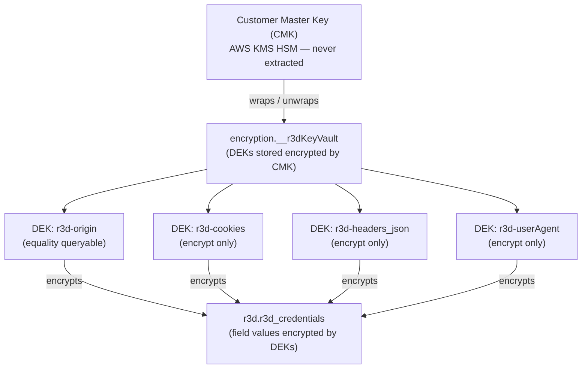
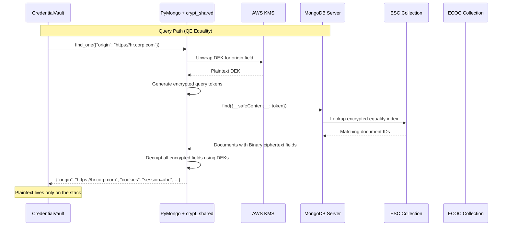
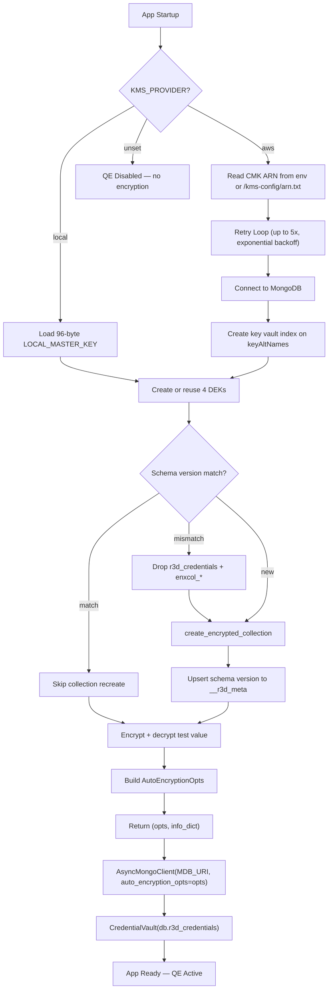

# Queryable Encryption in R3D: Searching Ciphertext Without Seeing It

*A standalone deep-dive into how R3D uses MongoDB Queryable Encryption to protect captured credentials while keeping them searchable. For the broader architecture, see [Part 1](part1-architecture.md). For the earlier CSFLE-based implementation, see [Part 4](part4-csfle.md).*

---

## Why Not Just CSFLE?

Part 4 of this series described how R3D encrypted credentials using MongoDB Client-Side Field-Level Encryption. CSFLE was a meaningful step: the server never saw plaintext, the master key lived in an HSM, and the CredentialVault pattern eliminated in-memory credential caching.

But CSFLE has a structural limitation. To enable queries on an encrypted field, CSFLE uses **deterministic encryption** -- the same plaintext always produces the same ciphertext. This means an attacker with database access can perform frequency analysis: if `origin` value X appears 47 times and Y appears 3 times, the ciphertext distribution reveals which is which, even without the key.

MongoDB Queryable Encryption (QE) solves this. It uses **non-deterministic encryption** for equality queries -- the same plaintext produces different ciphertext each time. The server matches queries against a structured encrypted index (not against repeated ciphertext values), eliminating frequency leakage entirely.

R3D v2 migrated from CSFLE to QE. The CredentialVault pattern stayed the same. The underlying cryptographic machinery changed completely.

---

## The Key Hierarchy

QE, like CSFLE, uses a two-tier key system. But understanding the full chain matters, because each tier serves a distinct security purpose:



**Tier 1: Customer Master Key (CMK)** -- Lives in AWS KMS, inside a FIPS 140-2 Level 3 HSM. It never leaves the hardware. Its only job is wrapping and unwrapping Data Encryption Keys.

**Tier 2: Data Encryption Keys (DEKs)** -- One per encrypted field. Stored encrypted in `encryption.__r3dKeyVault`. The PyMongo driver fetches the encrypted DEK, sends it to KMS for unwrapping, then uses the plaintext DEK locally to encrypt/decrypt field values.

R3D creates four DEKs, one per sensitive field:

```python
_FIELD_DEFS = [
    ("origin",       True),   # equality-queryable
    ("cookies",      False),  # encrypt only
    ("headers_json", False),  # encrypt only
    ("userAgent",    False),  # encrypt only
]
```

Each DEK is registered with a key alt name (`r3d-origin`, `r3d-cookies`, etc.) so bootstrap is idempotent -- if the DEK already exists, it's reused:

```python
key_ids = {}
for name, _ in _FIELD_DEFS:
    alt = f"r3d-{name}"
    existing = kv.find_one({"keyAltNames": alt})
    key_ids[name] = (
        existing["_id"]
        if existing
        else client_encryption.create_data_key(
            "aws", master_key=master_key, key_alt_names=[alt]
        )
    )
```

---

## What QE Does Differently on the Wire

When the vault calls `find_one({"origin": "https://hr.corp.com"})`, here is what actually happens:



The critical difference from CSFLE: the query token sent to the server is **not** the encrypted field value. It's a derived token that the server can match against a structured index in the **ESC** (Encrypted Search Collection) without learning anything about the plaintext. Two identical queries produce different tokens, and two identical stored values produce different ciphertext.

The **ECOC** (Encrypted Compaction Collection) tracks metadata about encrypted operations. This is what grows over time and needs periodic compaction.

---

## Schema Design: What Gets Encrypted and Why

The encrypted fields schema defines what QE protects and how it can be queried:

```python
encrypted_fields = {
    "fields": [
        {
            "path": "origin",
            "bsonType": "string",
            "keyId": key_ids["origin"],
            "queries": {"queryType": "equality", "contention": 4},
        },
        {"path": "cookies", "bsonType": "string", "keyId": key_ids["cookies"]},
        {"path": "headers_json", "bsonType": "string", "keyId": key_ids["headers_json"]},
        {"path": "userAgent", "bsonType": "string", "keyId": key_ids["userAgent"]},
    ]
}
```

### The `origin` field -- equality-queryable

This is the only field R3D queries directly. The vault does `find_one({"origin": origin})` and `delete_many({"origin": origin})`. QE's equality query type enables both operations on ciphertext.

The `contention: 4` parameter is a concurrency knob. QE tracks encrypted field/value occurrences using an internal counter. Contention partitions this counter into an array (contention=4 means 5 slots, indexed 0-4). Each write increments a random slot, reducing lock contention on concurrent inserts. R3D uses 4 instead of the default 8 because credential storage has low write concurrency -- typically one origin at a time via the Chrome extension.

### The encrypt-only fields -- `cookies`, `headers_json`, `userAgent`

These three fields are never queried -- they are encrypted without indexing. They can only be accessed by reading a document found via `origin` lookup, at which point the driver decrypts them transparently.

`userAgent` was added in the QE migration (schema version 2). In the original CSFLE implementation, it was stored as plaintext. Browser fingerprint strings like `Mozilla/5.0 (Windows NT 10.0; Win64; x64) AppleWebKit/537.36` reveal the tester's actual browser and OS during an engagement -- information that should not leak in a database breach.

### What stays plaintext

`capturedAt` (datetime) is intentionally unencrypted. It's used for sorting (`sort("capturedAt", -1)`) and is not sensitive -- knowing *when* a credential was captured reveals nothing about the credential itself. Keeping it plaintext means the server can sort efficiently without requiring range queries on encrypted data.

---

## Schema Versioning: Evolving an Immutable Schema

QE encrypted field schemas are immutable after collection creation. Adding `userAgent` as a 4th encrypted field meant the collection had to be dropped and recreated. For a production system, this needs a safe, automated migration path.

R3D tracks a schema version in the `encryption.__r3d_meta` collection:

```python
_QE_SCHEMA_VERSION = 2
```

The `_migrate_qe_collection` function runs during every bootstrap:

```python
def _migrate_qe_collection(db, setup_client, client_encryption,
                            encrypted_fields, provider, master_key):
    meta_col = setup_client["encryption"]["__r3d_meta"]
    meta = meta_col.find_one({"_id": "qe_schema_version"})
    stored_version = meta["version"] if meta else 0

    needs_create = "r3d_credentials" not in db.list_collection_names()

    if not needs_create and stored_version == _QE_SCHEMA_VERSION:
        return  # Schema matches — nothing to do

    if not needs_create and stored_version != _QE_SCHEMA_VERSION:
        print(f"QE: Schema version mismatch (stored={stored_version}, "
              f"current={_QE_SCHEMA_VERSION}) — recreating r3d_credentials")
        db.drop_collection("r3d_credentials")
        for suffix in ("esc", "ecoc", "ecc"):
            internal = f"enxcol_.r3d_credentials.{suffix}"
            if internal in db.list_collection_names():
                db.drop_collection(internal)

    client_encryption.create_encrypted_collection(
        db, "r3d_credentials", encrypted_fields, provider, master_key,
    )

    meta_col.update_one(
        {"_id": "qe_schema_version"},
        {"$set": {"version": _QE_SCHEMA_VERSION}},
        upsert=True,
    )
```

Three cases:

1. **Collection doesn't exist** (fresh deploy) -- create it with the current schema, write the version.
2. **Collection exists, version matches** -- skip entirely. Bootstrap is a no-op.
3. **Collection exists, version mismatch** -- drop `r3d_credentials` and its QE internal collections (`enxcol_.r3d_credentials.esc`, `.ecoc`, `.ecc`), recreate with the new schema, update the version.

This is safe for R3D because credentials are ephemeral engagement data. Losing them on a schema upgrade during a container restart is acceptable -- the Chrome extension will push them again when the next engagement session starts.

---

## The CredentialVault: QE's Application Layer

The `CredentialVault` class is QE's consumer. It never touches ciphertext directly -- `AutoEncryptionOpts` on the `AsyncMongoClient` makes encryption transparent. The vault's security value comes from what it *doesn't* do: cache.

```python
class CredentialVault:
    def __init__(self, credentials_col):
        self._col = credentials_col  # Motor collection with auto-decryption

    async def get_context(self, origin: str) -> dict:
        doc = await self._col.find_one({"origin": origin})
        if not doc:
            return {}
        return {
            "cookies": doc.get("cookies", ""),
            "headers": json.loads(doc.get("headers_json", "{}")),
            "userAgent": doc.get("userAgent", ""),
        }
```

When `get_context` returns, the decrypted credentials exist only in the caller's stack frame. No global dict, no LRU cache, no Redis layer. The Python garbage collector reclaims the memory as soon as the reference count drops to zero.

### Store: delete-then-insert

The store path replaces credentials for an origin by deleting the existing document first:

```python
async def store(self, origin, cookies, headers, user_agent):
    await self._col.delete_many({"origin": origin})
    await self._col.insert_one({
        "origin": origin,
        "cookies": cookies,
        "headers_json": json.dumps(headers),
        "userAgent": user_agent,
        "capturedAt": datetime.utcnow(),
    })
```

Both `delete_many` and `insert_one` are transparently handled by QE. The driver encrypts `origin` for the delete query, encrypts all four fields on the insert, and writes ciphertext to the server. The application code has no awareness of the encryption layer.

### list_origins: metadata without full decrypt

The dashboard needs to show which origins have stored credentials, but not the credentials themselves:

```python
async def list_origins(self) -> list[dict]:
    results = []
    async for doc in self._col.find().sort("capturedAt", -1).limit(100):
        results.append({
            "origin": doc.get("origin", ""),
            "hasCookies": bool(doc.get("cookies")),
            "headerKeys": list(json.loads(doc.get("headers_json", "{}")).keys()),
            "hasUserAgent": bool(doc.get("userAgent")),
            "capturedAt": doc.get("capturedAt", "").isoformat()
                if isinstance(doc.get("capturedAt"), datetime) else "",
        })
    return results
```

QE auto-decrypts every field on every document returned by the cursor. The vault discards the actual credential values and returns only boolean indicators and key names. This is a deliberate information-minimization pattern -- the dashboard shows "has cookies: yes" without ever sending the cookie value over the API.

---

## Compaction: Cleaning Up QE Metadata

Every write operation to a QE-encrypted collection appends metadata to the ECOC (Encrypted Compaction Collection). This metadata enables the encrypted indexes to function, but it grows unboundedly and, if left unchecked, can leak information about the volume of write operations.

MongoDB provides `compactStructuredEncryptionData` to clean this up. R3D runs it on graceful shutdown:

```python
async def compact_qe_metadata(db) -> bool:
    try:
        await db.command("compactStructuredEncryptionData", "r3d_credentials")
        print("QE: compaction completed")
        return True
    except Exception as e:
        print(f"QE: compaction skipped — {e}")
        return False
```

Hooked into the FastAPI lifespan:

```python
@asynccontextmanager
async def lifespan(app: FastAPI):
    # ... startup: bootstrap QE, create indexes, init vault ...
    yield
    # Graceful shutdown: compact QE metadata to prevent ECOC bloat
    if MDB_URI and getattr(app.state, "sessions_col", None) is not None:
        db = app.state.sessions_col.database
        await compact_qe_metadata(db)
```

Every container restart, every deployment, every `docker compose down` -- the ECOC gets compacted. For R3D's workload (dozens to hundreds of credential operations per engagement), this keeps metadata well under control.

---

## Bootstrap: From Cold Start to Encrypted Collection

The full bootstrap sequence runs synchronously before the async app starts. Here is the end-to-end flow:



The retry loop with exponential backoff is essential for container orchestration. In Docker Compose, the proxy container starts after `kms-init` completes and MongoDB is healthy, but TLS handshakes to LocalStack's self-signed certificate can fail transiently. The backoff (2s, 4s, 8s, 16s, 32s) handles this reliably.

The smoke test validates the entire chain before the app accepts traffic:

```python
def _qe_smoke_test(client_encryption, key_ids):
    sentinel = "r3d-smoke-test"
    encrypted = client_encryption.encrypt(
        sentinel,
        Algorithm.AEAD_AES_256_CBC_HMAC_SHA_512_Random,
        key_id=key_ids["cookies"],
    )
    decrypted = client_encryption.decrypt(encrypted)
    if decrypted != sentinel:
        raise RuntimeError(
            f"Smoke test failed: expected '{sentinel}', got '{decrypted}'"
        )
```

If the KMS key is inaccessible, the DEKs are corrupted, or the `crypt_shared` library has a version mismatch, this test catches it before a single credential is processed.

---

## Dev vs Production KMS

The same bootstrap code path handles both environments. The difference is three environment variables:

| | Development (LocalStack) | Production (AWS KMS) |
|---|---|---|
| `KMS_PROVIDER` | `aws` | `aws` |
| `AWS_KMS_KEY_ARN` | Read from `/kms-config/arn.txt` | Set directly in env |
| `AWS_KMS_ENDPOINT` | `localstack:4566` | **Unset** (defaults to real AWS) |
| `AWS_ACCESS_KEY_ID` | `test` | **Unset** (use IAM role) |
| TLS verification | Disabled (self-signed cert) | Enabled (default) |
| Key source | `kms-init` sidecar creates on startup | Terraform-managed CMK |

The `kms-init` sidecar (`kms-init.sh`) runs once in Docker Compose, creates a CMK in LocalStack, and writes the ARN to a shared volume. It's idempotent -- if the key already exists from a previous run, it skips creation and just verifies HTTPS is working:

```bash
if [ -f /kms-config/arn.txt ]; then
  EXISTING_ARN=$(cat /kms-config/arn.txt)
  if aws kms describe-key --key-id "$EXISTING_ARN" >/dev/null 2>&1; then
    echo "Key is still valid in LocalStack — skipping creation."
    verify_https
    exit $?
  fi
fi
```

In production, Terraform provisions the CMK with automatic annual rotation, a restrictive IAM policy scoped to the service role, and CloudTrail auditing of every KMS API call.

---

## Testing QE

The test suite validates QE at three levels:

### Unit tests (no Docker)

Five tests in `TestBootstrapQENoDocker` verify the bootstrap's edge cases without any running infrastructure: disabled when no key is set, rejects bad key length, handles missing AWS ARN, provider selection routing. These run in every CI pipeline.

### Integration tests (Docker required)

Marked with `@pytest.mark.qe`, these run against MongoDB Atlas Local 8.0 + LocalStack:

```bash
docker compose -f docker-compose.test.yml run --rm test
```

**`TestQEBootstrap`** verifies the bootstrap returns enabled status, creates all 4 DEKs (including the new `r3d-userAgent`), creates the encrypted collection, and persists the schema version.

**`TestQERoundTrip`** is the cryptographic proof:

```python
def test_raw_read_is_ciphertext(self):
    doc = {
        "origin": "https://payroll.corp.com",
        "cookies": "sid=secret_value",
        "headers_json": "{}",
        "userAgent": "Chrome/120",
    }
    self.enc_col.insert_one(doc)

    raw = self.raw_col.find_one({"_id": doc["_id"]})
    assert isinstance(raw["cookies"], Binary) or raw["cookies"] != "sid=secret_value"
    assert isinstance(raw["userAgent"], Binary) or raw["userAgent"] != "Chrome/120"
```

This test writes through the QE-enabled client and reads through a raw client. The raw client sees only `Binary` ciphertext. If QE is misconfigured, this test catches it immediately.

**`test_compaction_runs_without_error`** executes `compactStructuredEncryptionData` against a live encrypted collection and verifies it returns `ok: 1`.

### Full-stack API test

`TestQEAPIRoundTrip` boots the entire FastAPI app with a QE lifespan, pushes credentials through the `/r3d/auth-context` endpoint, and reads them back -- validating that QE works end-to-end through the HTTP layer, not just at the driver level.

---

## What the Server Sees

If you connect to MongoDB as an administrator and inspect `r3d_credentials` directly:

```javascript
// What the MongoDB server stores (raw view):
{
  "_id": ObjectId("..."),
  "origin": Binary(6, "..."),        // 200+ bytes of ciphertext
  "cookies": Binary(6, "..."),       // ciphertext
  "headers_json": Binary(6, "..."),  // ciphertext
  "userAgent": Binary(6, "..."),     // ciphertext
  "capturedAt": ISODate("2026-03-20T14:30:00Z"),  // plaintext (intentional)
  "__safeContent__": [               // QE encrypted index tokens
    Binary(0, "..."),
    Binary(0, "..."),
    Binary(0, "..."),
    Binary(0, "...")
  ]
}
```

Every sensitive field is BSON `Binary` subtype 6 (encrypted). The `__safeContent__` array contains the encrypted equality index tokens that QE uses for server-side matching. These tokens are non-deterministic -- inserting the same `origin` twice produces different tokens and different ciphertext.

A database backup (`mongodump`) captures this. Without access to the AWS KMS key, the backup is a collection of opaque blobs.

---

## Security Properties

| Property | Mechanism |
|----------|-----------|
| Credentials encrypted at rest | QE encrypts fields before they leave the application |
| Server never sees plaintext | Client-side encryption -- server stores only Binary ciphertext |
| No frequency analysis | Non-deterministic encryption -- same value produces different ciphertext |
| Master key in HSM | AWS KMS -- CMK never extracted, accessed only via IAM |
| No plaintext in memory | CredentialVault -- on-demand decrypt, stack-only lifetime |
| Memory dump yields nothing | Heap contains only the vault reference, not decrypted credentials |
| Per-request isolation | Each request decrypts independently -- no shared state |
| Queryable encrypted fields | QE equality on `origin` -- server-side index lookup on ciphertext |
| Concurrent write safety | `contention: 4` partitions internal counter, prevents lock contention |
| Metadata cleanup | `compactStructuredEncryptionData` on shutdown prevents ECOC bloat |
| Schema evolution | Version tracking in `__r3d_meta` with auto-migration |

---

## What Changed from CSFLE to QE

For teams considering the same migration:

| Aspect | CSFLE (Part 4) | QE (Current) |
|--------|----------------|--------------|
| Equality query encryption | Deterministic (frequency leakage) | Non-deterministic (no leakage) |
| Encrypted field count | 3 (`origin`, `cookies`, `headers_json`) | 4 (+ `userAgent`) |
| Internal collections | None | ESC, ECOC, ECC per encrypted collection |
| `contention` parameter | N/A | Tunable per queryable field |
| Compaction required | No | Yes (`compactStructuredEncryptionData`) |
| Schema immutability | Schema changes require collection recreate | Same, but automated with version tracking |
| API surface | `schema_map` + explicit `Algorithm.Deterministic` | `encrypted_fields_map` + `create_encrypted_collection` |
| PyMongo driver config | `auto_encryption_opts` with `schema_map` | `auto_encryption_opts` with `encrypted_fields_map` |
| `crypt_shared` library | Required | Required (same) |
| CredentialVault pattern | Identical | Identical -- QE is transparent to the application |

The most important row is the last one. The CredentialVault didn't change. The FastAPI routers didn't change. The Chrome extension's auth-context push didn't change. QE's entire value proposition -- stronger cryptographic guarantees, no frequency leakage, concurrent write safety -- was delivered as an infrastructure upgrade that the application layer never noticed.

---

*For the full R3D architecture, start at [Part 1: Why We Built an AI-Powered Red Team Platform](part1-architecture.md).*
