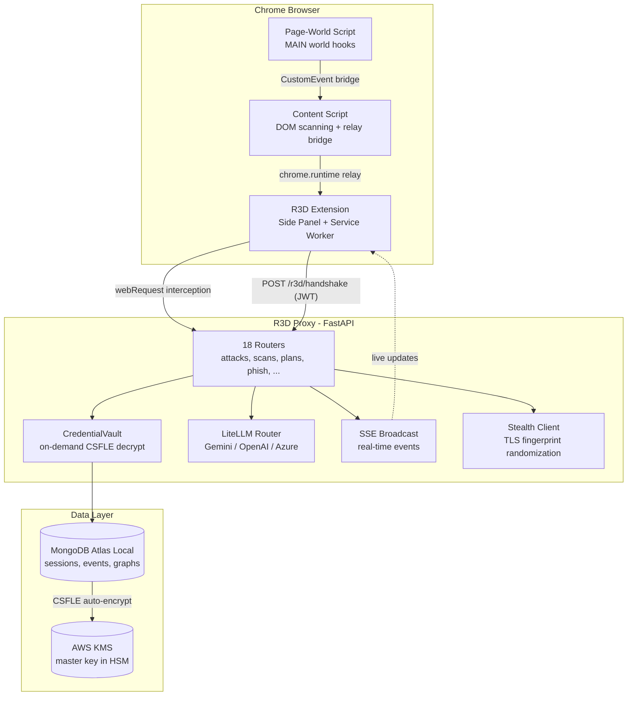

# Part 1: Why We Built an AI-Powered Red Team Platform

*This is Part 1 of a 6-part series on building R3D, an AI-powered offensive security platform with enterprise-grade credential protection.*

| Part | Title |
|------|-------|
| **1** | **Why We Built an AI-Powered Red Team Platform** (you are here) |
| 2 | [Inside the Chrome Extension: Intercepting Everything](part2-extension.md) |
| 3 | [Server-Side Attack Infrastructure with FastAPI](part3-proxy.md) |
| 4 | [MongoDB CSFLE + AWS KMS: Encrypting Credentials at the Field Level](part4-csfle.md) |
| 5 | [Operational Security: Stealth, Rotation, and Monitoring](part5-opsec.md) |
| 6 | [From `docker-compose up` to Production: Deploying R3D](part6-deployment.md) |

---

## The Problem: Pentesting Toolchains Are Broken

Web application penetration testing in 2026 looks a lot like it did in 2014. You fire up Burp Suite, open a browser, click around the target, and manually hunt for vulnerabilities across dozens of tabs. When you find something, you copy-paste evidence into a report. When the engagement spans multiple systems with shared authentication, you juggle cookies between tools and pray nothing expires.

The toolchain has three fundamental problems:

1. **Fragmented workflows.** Traffic interception, vulnerability detection, exploit generation, credential management, and reporting all live in different tools with different data formats. Context is lost at every handoff.

2. **No server-side operations.** Browser-based interception can't bypass CORS, can't control TLS fingerprints, and can't replay credentials without the original session. Half of what you need to prove requires a server-side HTTP client.

3. **Credential insecurity.** Most tools store captured session cookies and tokens in plaintext -- in config files, in memory, or in SQLite databases. A compromise of the testing tool means a compromise of every credential from every engagement.

R3D is our answer. A Chrome extension for live traffic interception, a FastAPI proxy for server-side operations, LLM routing for intelligent triage, and MongoDB with client-side field-level encryption for credential protection. One platform, one engagement session, zero plaintext credentials at rest.

---

## Architecture at a Glance



The extension captures traffic and sends events to the proxy. The proxy persists sessions in MongoDB, routes AI queries through LiteLLM, runs server-side attacks with stored credentials, and pushes real-time updates back to the extension over SSE. All credentials are encrypted at the field level before they touch MongoDB -- the database server never sees plaintext.

---

## Design Decisions and Why

### Chrome Side Panel (Not Popup or DevTools)

Chrome popups close when you click away. DevTools panels require the inspector to be open. Neither is acceptable during an active security audit where you're navigating the target application.

The Side Panel stays open as you browse. It shows live session state, findings, and controls without stealing focus from the target. The extension registers it in the manifest:

```json
"side_panel": {
  "default_path": "sidepanel/sidepanel.html"
}
```

The side panel connects to the service worker via a persistent port, receiving real-time state snapshots as the audit progresses. Session controls, finding details, exploit generation, and phishing management all live in this single persistent surface.

### MAIN World Content Script

Chrome extension content scripts run in an isolated world by default -- they can't see or hook the page's JavaScript globals. That's a problem when you need to intercept `fetch()`, `XMLHttpRequest`, `WebSocket`, `eval()`, and DOM mutations at the source.

R3D registers a second content script in the `MAIN` world, which shares the page's JavaScript context:

```json
{
  "matches": ["<all_urls>"],
  "js": ["content/page-world.js"],
  "run_at": "document_start",
  "world": "MAIN",
  "all_frames": false
}
```

This script wraps `fetch`, `XHR`, `WebSocket`, `eval`, `document.write`, and `innerHTML` mutations -- capturing request/response bodies, dangerous sink invocations, and prototype pollution attempts. Since MAIN world scripts can't access `chrome.runtime`, data flows through `CustomEvent` dispatches to the isolated content script, which relays to the service worker.

### FastAPI Over Flask or Django

The proxy needs to handle concurrent HTTP replays, LLM API calls, MongoDB operations, and SSE streams without blocking. FastAPI's async-first design makes this natural. Its dependency injection system provides clean access to the credential vault:

```python
def get_vault(request: Request) -> CredentialVault:
    """FastAPI dependency to access the on-demand credential vault."""
    return request.app.state.credential_vault
```

The application assembles 18 routers covering attacks, authentication, scanning, fuzzing, phishing, AI planning, sessions, graphs, reports, and more. Each router receives the vault as an injected dependency rather than importing a global.

### MongoDB Over Postgres

Session events are heterogeneous -- HTTP requests, findings, system fingerprints, attack graph nodes, credential snapshots -- each with different shapes. MongoDB's flexible schema means no migration headaches when the event format evolves.

More importantly, MongoDB is the only database that offers **Client-Side Field-Level Encryption (CSFLE)**. With CSFLE, the application encrypts sensitive fields *before* they leave the process. The MongoDB server stores and indexes ciphertext it can never decrypt. When backed by AWS KMS, the master encryption key never leaves the HSM -- not even the application has the raw key material.

For a tool that handles stolen credentials from Fortune 500 engagements, this isn't optional. We'll cover CSFLE in depth in [Part 4](part4-csfle.md).

### LiteLLM for Multi-Provider Routing

R3D uses LLMs for vulnerability triage, exploit generation, attack planning, and report summarization. Different teams prefer different providers -- some mandate Gemini, others use Azure OpenAI, some run local models.

LiteLLM provides a unified `acompletion()` interface that routes to any provider. The proxy exposes an OpenAI-compatible `/v1/chat/completions` endpoint, so the extension doesn't need to know which model is behind it:

```python
response = await litellm.acompletion(
    model=DEFAULT_MODEL,
    messages=[
        {"role": "system", "content": "You are R3D, an offensive security intelligence system."},
        {"role": "user", "content": prompt},
    ],
    response_format={"type": "json_object"},
)
```

---

## What a Typical Engagement Looks Like

Here's the end-to-end workflow during a web application security assessment:

**1. Start the proxy.**
`docker-compose up` brings up MongoDB, LocalStack KMS, the KMS initialization sidecar, and the R3D proxy. CSFLE bootstraps automatically -- the startup banner confirms `CSFLE: ✓ AWS KMS verified`.

**2. Install and connect the extension.**
The extension auto-discovers the proxy by probing localhost ports and performing a `POST /r3d/handshake`. The proxy validates the extension ID, rate-limits the attempt, and mints a 24-hour JWT. The master API key is never transmitted.

**3. Launch an audit session.**
Click "Launch Audit" in the side panel. The extension generates a random codename, creates a session via `POST /r3d/sessions/start`, and activates `webRequest` listeners. Every HTTP request the browser makes is now captured, analyzed, and streamed to the proxy.

**4. Browse the target.**
Navigate the application normally. The service worker's analysis pipeline scores each request through header, cookie, JWT, IDOR, and RBAC auditors. The page-world script captures `fetch`/`XHR` bodies, dangerous sink calls, and prototype pollution attempts. Findings appear in the side panel in real time.

**5. Store authentication context.**
When the extension detects session cookies or authorization headers, it pushes them to the proxy via `POST /r3d/auth-context`. The proxy's `CredentialVault` encrypts them with CSFLE and stores them in MongoDB. The credentials now exist only as ciphertext on disk.

**6. Run server-side attacks.**
Click "Generate Exploit" on a finding. The AI generates a test -- which may be a browser snippet, a server-side HTTP replay, a parameter fuzz, or a multi-step attack plan. Server-side operations use the vault to inject stored credentials, bypass CORS, and control TLS fingerprints.

**7. Execute attack plans.**
For complex engagements, the AI generates multi-step plans that chain vulnerabilities across systems: credential replay, pivot testing, parameter fuzzing, and phishing clones -- all executed server-side with stored authentication context. Each step's output feeds into the next.

**8. Collect proofs and report.**
The proxy generates HTML proof pages, the dashboard aggregates findings with severity and CWE mappings, and the report engine produces deliverables. Session data persists in MongoDB for archival.

---

## The Tech Stack

| Component | Technology | Why |
|-----------|------------|-----|
| Extension | Chrome Manifest V3 | Side panel, service worker, MAIN world hooks |
| Proxy | Python / FastAPI 5.3.0 | Async, dependency injection, 18+ routers |
| Database | MongoDB (Atlas Local 8.0) | Flexible schema, CSFLE support |
| Encryption | MongoDB CSFLE + AWS KMS | Field-level, client-side, HSM-backed |
| LLM | LiteLLM | Multi-provider routing (Gemini, OpenAI, Azure) |
| HTTP Client | httpx with HTTP/2 | Stealth TLS fingerprinting |
| Auth | JWT + bcrypt | Token rotation, multi-user RBAC |
| Infrastructure | Docker Compose, Terraform | LocalStack dev, production IAM/KMS |
| Testing | pytest + pytest-asyncio | Unit, API, and CSFLE integration tests |
| Reports | WeasyPrint + Jinja2 | PDF generation from templates |

---

## What's Coming Next

This post covered the *why* and the *what*. The remaining five parts go deep on the *how*:

- **[Part 2](part2-extension.md)** tears apart the Chrome extension -- how the service worker, page-world hooks, and content script bridge work together to intercept everything without breaking the page.

- **[Part 3](part3-proxy.md)** walks through the FastAPI proxy -- server-side HTTP replay, AI-powered attack planning, phishing infrastructure, and the real-time event system.

- **[Part 4](part4-csfle.md)** is the security deep-dive -- MongoDB CSFLE with AWS KMS, the CredentialVault pattern, and why on-demand decryption is worth the 5ms overhead.

- **[Part 5](part5-opsec.md)** covers operational security -- TLS fingerprint randomization, JWT rotation, handshake hardening, internal-only monitoring, and container lockdown.

- **[Part 6](part6-deployment.md)** takes you from `docker-compose up` to production -- LocalStack for development, Terraform for AWS, and deployment patterns for EC2, ECS, and EKS.

---

*Next up: [Part 2 -- Inside the Chrome Extension: Intercepting Everything](part2-extension.md)*
