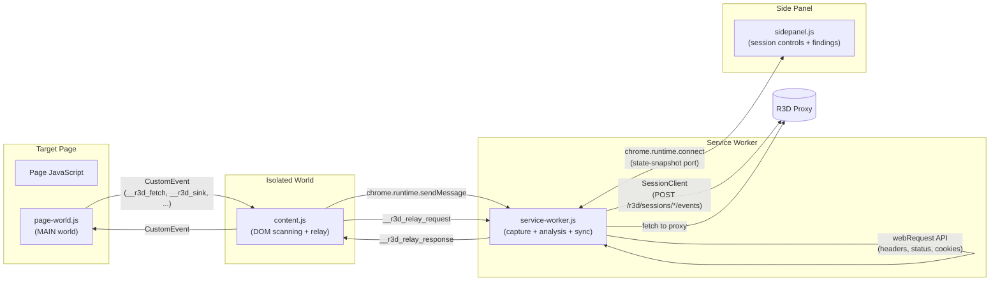

# Part 2: Inside the Chrome Extension -- Intercepting Everything

*This is Part 2 of a 6-part series on building R3D. [Start from Part 1](part1-architecture.md) for the full architecture overview.*

---

## The Challenge

Build a Chrome extension that:

1. Captures every HTTP request the browser makes, with headers and response metadata
2. Hooks JavaScript globals (`fetch`, `XHR`, `WebSocket`, `eval`, `document.write`) to capture request/response bodies and dangerous sink invocations
3. Scans the DOM for secrets in cookies, localStorage, sessionStorage, and inline scripts
4. Runs LLM-generated exploit code on the target page without being blocked by CSP
5. Does all of this without breaking the target application

The answer is a four-component architecture: a service worker for traffic capture and orchestration, a MAIN-world page script for JavaScript hooking, an isolated content script for DOM scanning and event bridging, and a side panel for the operator interface.



---

## The Service Worker: Capture Engine

The service worker (`background/service-worker.js`) is the central nervous system. It loads 15 analysis libraries via `importScripts`, manages the session state machine, captures traffic through `chrome.webRequest`, and syncs everything to the proxy.

### Session State Machine

Nothing is captured until the operator explicitly starts a session. The state machine enforces this:

```
idle -> starting -> active -> paused -> active -> ending -> ended
```

```javascript
const session = {
  state: 'idle',  // idle | starting | active | paused | ending | ended
  id: null,
  name: null,
  startedAt: null,
  counters: { requests: 0, findings: 0, systems: 0, patterns: 0, aiAnalyses: 0 },
};

function isSessionActive() { return session.state === 'active'; }
```

Every capture and analysis function gates on `isSessionActive()`. When the operator clicks "Launch Audit" in the side panel, the extension generates a random codename (e.g., "Shadow Falcon-042"), calls `SessionClient.startSession()` to create the session on the proxy, and transitions to `active`.

### Event Buffer and Flush

Rather than sending every captured event individually, the service worker buffers events and flushes them in batches every 15 seconds:

```javascript
const eventBuffer = [];
const FLUSH_INTERVAL_MS = 15000;

function bufferEvent(type, data) {
  if (!isSessionActive()) return;
  eventBuffer.push({ type, ts: Date.now(), data });
}

async function flushEventBuffer() {
  if (eventBuffer.length === 0 || !session.id) return;
  const batch = eventBuffer.splice(0);
  const result = await SessionClient.appendEvents(session.id, batch);
  if (result.error) {
    eventBuffer.unshift(...batch);  // Re-queue on failure
    syncHealth.consecutiveFailures++;
  }
}
```

The `syncHealth` object tracks flush status. After three consecutive failures, the side panel shows a "disconnected" indicator. Events are never lost -- they're re-queued on failure and flushed when connectivity returns.

### Traffic Analysis Pipeline

When a request completes, it passes through a multi-stage analysis pipeline:

1. **Self-traffic exclusion** -- requests to the proxy (localhost:4000) are ignored so the extension doesn't analyze its own backend calls
2. **Request store** -- captures URL, method, status, headers, timing
3. **Header auditor** -- scores security headers (CSP, HSTS, X-Frame-Options) per domain
4. **Cookie auditor** -- checks Secure, HttpOnly, SameSite flags; detects session cookies
5. **JWT analyzer** -- decodes tokens, checks expiry, identifies weak algorithms
6. **IDOR detector** -- catalogs endpoints with sequential/guessable identifiers
7. **RBAC analyzer** -- builds a permission matrix across observed roles
8. **Advanced detectors** -- CORS misconfigurations, open redirects, information disclosure
9. **Pattern engine** -- matches against known vulnerability patterns
10. **Policy engine** -- evaluates findings against configurable security policies
11. **System fingerprinter** -- groups domains into logical systems with risk scores
12. **Evidence collector** -- attaches request/response evidence to findings

Each detector that fires a finding triggers a CWE classification, deduplication check, and severity assignment. Deduplicated findings are buffered as events and flushed to the proxy.

### Chrome Debugger for Response Bodies

The `webRequest` API captures headers but not response bodies. For deeper inspection, the extension optionally attaches the Chrome Debugger Protocol (CDP):

```javascript
chrome.debugger.attach({ tabId }, "1.3");
chrome.debugger.sendCommand({ tabId }, "Runtime.evaluate", {
  expression: snippet,
  awaitPromise: true,
});
```

The debugger serves double duty: it captures response bodies for analysis, and it executes LLM-generated test snippets on the target page. CDP's `Runtime.evaluate` runs code in the page's main context, bypassing extension CSP restrictions that would block `chrome.scripting.executeScript` for inline code.

---

## The Page-World Script: Hooking JavaScript Globals

The page-world script (`content/page-world.js`) runs in the `MAIN` world -- the same JavaScript context as the target page. This is critical because isolated-world content scripts can't see or override the page's `fetch`, `XMLHttpRequest`, or `WebSocket` implementations.

### Dangerous Sink Monitoring

The script wraps `eval`, `document.write`, and watches for script-like `innerHTML` mutations:

```javascript
const origEval = window.eval;
window.eval = function () {
  logSink('eval', arguments);
  return origEval.apply(this, arguments);
};

const origWrite = document.write;
document.write = function () {
  logSink('document.write', arguments);
  return origWrite.apply(this, arguments);
};

const observer = new MutationObserver((mutations) => {
  for (const m of mutations) {
    for (const node of m.addedNodes) {
      if (node.nodeType === 1) {
        const html = node.innerHTML || '';
        if (/<script|onerror|onload|javascript:/i.test(html)) {
          logSink('innerHTML(script-like)', [html.substring(0, 200)]);
        }
      }
    }
  }
});
observer.observe(document.documentElement, { childList: true, subtree: true });
```

Each sink invocation fires a `__r3d_sink` CustomEvent with a stack trace and argument preview.

### Fetch and XHR Interception

The `webRequest` API gives you headers, but the page-world script gives you bodies:

```javascript
const origFetch = window.fetch;
window.fetch = function (input, init) {
  const url = (typeof input === 'string') ? input : (input.url || '');
  if (isNoisyUrl(url)) return origFetch.apply(this, arguments);

  const promise = origFetch.apply(this, arguments);
  promise.then(response => {
    const cloned = response.clone();
    const contentType = cloned.headers.get('content-type') || '';
    if (contentType.includes('json') || contentType.includes('text')) {
      cloned.text().then(body => {
        window.dispatchEvent(new CustomEvent('__r3d_fetch', {
          detail: { url, method, status: cloned.status, bodyPreview: body.substring(0, 5000) }
        }));
      });
    }
  });
  return promise;
};
```

A noise filter skips ad/analytics domains (Google Ads, DoubleClick, TikTok analytics, etc.) to avoid flooding the analysis pipeline with irrelevant traffic. XHR and WebSocket get the same treatment -- hooked, filtered, and dispatched as CustomEvents.

### The CSP-Safe Proxy Relay

Here's a subtle problem: when the AI generates a test snippet that needs to call the R3D proxy from the target page's context, the page's Content Security Policy blocks `fetch()` to `localhost:4000`. The page-world script solves this with a relay:

```javascript
window.__r3d_proxy = function(endpoint, body) {
  const id = '__r3d_relay_' + (++_relaySeq) + '_' + Date.now();
  return new Promise((resolve, reject) => {
    function handler(e) {
      if (e.detail && e.detail._relayId === id) {
        window.removeEventListener('__r3d_relay_response', handler);
        if (e.detail.error) reject(new Error(e.detail.error));
        else resolve(e.detail.data);
      }
    }
    window.addEventListener('__r3d_relay_response', handler);
    window.dispatchEvent(new CustomEvent('__r3d_relay_request', {
      detail: { _relayId: id, endpoint, body }
    }));
  });
};
```

Test snippets call `await window.__r3d_proxy('r3d/attack/fetch', { url, method })` instead of `fetch(proxyUrl)`. The flow is:

1. Page-world dispatches `__r3d_relay_request` CustomEvent
2. Content script picks it up and calls `chrome.runtime.sendMessage`
3. Service worker makes the actual `fetch()` to the proxy (service workers are not subject to page CSP)
4. Response flows back through `sendResponse` -> content script -> `__r3d_relay_response` CustomEvent

This relay is invisible to the target application and bypasses any CSP restrictions.

---

## The Content Script: DOM Scanning and Event Bridge

The content script (`content/content.js`) runs in the isolated world at `document_idle`. It handles two jobs: DOM-level security scanning and event bridging between the MAIN world and the service worker.

### Security Scanning

On every page load, the content script runs five scans:

**Cookie scanning** -- reads `document.cookie` and reports all JavaScript-accessible cookies. If a session cookie is readable from JS, it's missing the `HttpOnly` flag.

**Storage scanning** -- iterates `localStorage` and `sessionStorage` looking for keys matching sensitive patterns (`token`, `secret`, `password`, `jwt`, `auth`, `api_key`) and values that look like JWTs (`eyJ...`).

**Inline script scanning** -- finds `<script>` tags without `src` attributes and regex-matches for hardcoded API keys, AWS credentials, MongoDB URIs, and other secrets:

```javascript
const secretPatterns = [
  { regex: /["'](?:api[_-]?key|apiKey)["']\s*[:=]\s*["']([^"']{8,})["']/gi, label: 'API key' },
  { regex: /AKIA[0-9A-Z]{16}/g, label: 'AWS key' },
  { regex: /mongodb(\+srv)?:\/\/[^\s"'<>]+/gi, label: 'MongoDB URI' },
];
```

**Framework state extraction** -- detects `__NEXT_DATA__`, `__NUXT__`, Angular's `ng`, and Redux DevTools, extracting their state for analysis.

**Prototype pollution detection** -- checks URL parameters and hash fragments for `__proto__`, `constructor`, and `prototype` strings.

### Event Bridge

The content script binds listeners for all CustomEvents from the page-world script and forwards them to the service worker:

```javascript
window.addEventListener('__r3d_fetch', (e) => {
  send({ type: 'intercepted-fetch', detail: e.detail, url: location.href });
});
window.addEventListener('__r3d_sink', (e) => {
  send({ type: 'dangerous-sink', sink: e.detail, url: location.href });
});
```

It also handles the proxy relay -- picking up `__r3d_relay_request` events, calling `chrome.runtime.sendMessage`, and dispatching the response back as `__r3d_relay_response`. If the extension context is invalidated (e.g., the extension was reloaded), the content script stays silent rather than racing with a freshly-injected instance.

### CSP Violation Monitoring

The content script listens for `securitypolicyviolation` events, capturing which directives are being violated and by what. This gives the operator visibility into what the page's CSP actually blocks -- useful for understanding the target's security posture and for debugging test snippets that fail due to CSP.

---

## The Side Panel: Operator Interface

The side panel (`sidepanel/sidepanel.js`) is the operator's mission control. It connects to the service worker via a persistent port and renders live state.

### Live State Sync

```javascript
let port = chrome.runtime.connect({ name: 'r3d-sidepanel' });
port.onMessage.addListener(msg => {
  if (msg.type === 'state-snapshot' || msg.type === 'state-update') {
    snapshot = msg.state;
    render();
  }
});
port.onDisconnect.addListener(() => setTimeout(connect, 1000));
```

Every state change in the service worker -- new finding, request captured, system fingerprinted, sync health update -- triggers a `state-update` message. The side panel re-renders the relevant tab.

### Session Controls

When no session is active, the panel shows a "Launch Audit" button. It generates a random codename from two word lists:

```javascript
const _ADJ = ['Silent','Shadow','Crimson','Phantom','Iron','Midnight',...];
const _NOUN = ['Falcon','Viper','Sentinel','Hydra','Phoenix','Reaper',...];

function generateCodename() {
  const a = _ADJ[Math.floor(Math.random() * _ADJ.length)];
  const n = _NOUN[Math.floor(Math.random() * _NOUN.length)];
  return `${a} ${n}-${String(Math.floor(Math.random() * 1000)).padStart(3, '0')}`;
}
```

During an active session, the panel shows a timer, counters (requests, findings, systems), sync health indicator, and pause/end controls.

### Findings and Exploit Pipeline

The Findings tab renders findings as expandable drawers sorted by severity. Each finding has a "Generate Exploit" button that:

1. Sends `r3d-test-generate` to the service worker
2. The service worker calls the proxy's `/r3d/analyze` endpoint with the finding context
3. The AI returns an executable test -- either a browser snippet, a server-side HTTP request, or a multi-step plan
4. The panel shows a "Run in Browser" button
5. Clicking it sends `r3d-test-run`, which executes the test via CDP or the proxy's test queue
6. Results stream back through the state snapshot pipeline

### Dashboard Deep-Linking

The "Open Dashboard" button opens the proxy's web dashboard with a session hash parameter:

```javascript
function getDashboardUrl() {
  const sid = snapshot?.session?.id;
  if (sid && snapshot?.session?.state !== 'idle') {
    return DASHBOARD_BASE + '/#session=' + sid;
  }
  return DASHBOARD_BASE;
}
```

This deep-links directly to the active session in the full-featured dashboard, where the operator gets session timelines, attack graphs, and report generation.

---

## Auto-Discovery: Connecting Extension to Proxy

When the extension loads, it needs to find and authenticate with the R3D proxy. The `AIClient.autoDiscover()` function handles this automatically:

```javascript
async function autoDiscover(ports) {
  const tryPorts = ports || [4000, 4001, 4002];
  const extensionId = chrome.runtime?.id || 'unknown';
  for (const port of tryPorts) {
    const base = `http://localhost:${port}`;
    try {
      const resp = await fetch(`${base}/r3d/handshake`, {
        method: 'POST',
        headers: { 'Content-Type': 'application/json' },
        body: JSON.stringify({ extensionId }),
        signal: AbortSignal.timeout(2000),
      });
      if (!resp.ok) continue;
      const data = await resp.json();
      const token = data.token || data.apiKey;
      if (data.ok && token) {
        const endpoint = `${base}${data.endpoint || '/v1/chat/completions'}`;
        await saveConfig({ endpoint, apiKey: token });
        return { ok: true, endpoint, port };
      }
    } catch {}
  }
  return { ok: false };
}
```

The function probes localhost ports 4000-4002, sends a `POST /r3d/handshake` with the extension's Chrome ID, and receives a JWT token in response. The master API key is never transmitted -- the proxy mints a short-lived JWT that the extension stores in `chrome.storage.local` and uses for all subsequent API calls.

If a request fails with 401 (token expired), the `SessionClient` automatically calls `autoDiscover()` again to refresh the token:

```javascript
if (resp.status === 401) {
  const refreshed = await AIClient.autoDiscover();
  if (refreshed.ok) return request(method, path, body);
  return { error: 'Token expired and auto-refresh failed.' };
}
```

This means the extension transparently re-authenticates when JWTs expire, with zero operator intervention.

---

## The Extension's Heartbeat

While connected, the service worker sends a heartbeat to the proxy every 5 seconds via `POST /r3d/extension/heartbeat`. This serves two purposes:

1. The proxy dashboard shows real-time extension connection status
2. The extension detects proxy unavailability early, before the next event flush fails

Combined with the session state machine, event buffering, and auto-discovery, the extension maintains a resilient connection to the proxy -- buffering events during disconnections, re-authenticating on token expiry, and recovering state from `chrome.storage.local` after service worker restarts.

---

## Key Takeaways

Building a security-focused Chrome extension requires navigating Chrome's multi-world architecture:

- **Service worker** for traffic capture (`webRequest`), orchestration, and proxy communication -- but no DOM access
- **MAIN world script** for hooking JavaScript globals -- but no `chrome.runtime` access
- **Isolated content script** for DOM scanning and bridging the other two worlds
- **Side panel** for persistent UI that survives navigation

The CSP-safe proxy relay pattern (`window.__r3d_proxy` -> CustomEvent -> content script -> service worker -> proxy) is reusable in any extension that needs to make authenticated API calls from injected page-context code.

---

*Next up: [Part 3 -- Server-Side Attack Infrastructure with FastAPI](part3-proxy.md)*
