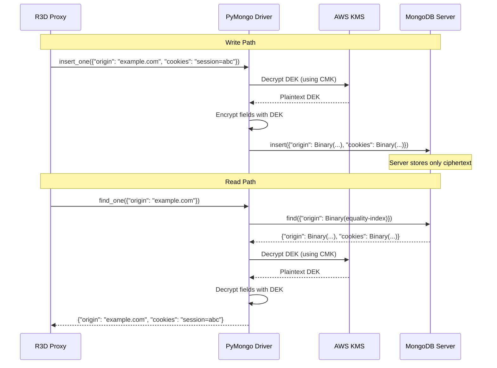

# Part 4: MongoDB CSFLE + AWS KMS -- Encrypting Credentials at the Field Level

*This is Part 4 of a 6-part series on building R3D. [Start from Part 1](part1-architecture.md) for the full architecture overview.*

> **Update:** R3D has since migrated from CSFLE to **MongoDB Queryable Encryption (QE)**, which replaces deterministic encryption with non-deterministic encryption and structured encrypted indexes. The CredentialVault pattern and KMS integration described below remain the same -- the cryptographic layer underneath changed. See the **[Queryable Encryption Deep Dive](QE.md)** for the current implementation.

---

## The Threat Model

Your red team proxy stores captured credentials from security engagements -- session cookies, authorization headers, OAuth tokens. These are the keys to Fortune 500 internal systems. Now consider what happens when the proxy itself is compromised:

| Attack Vector | What the attacker gets |
|---------------|----------------------|
| Memory dump / core dump | Every credential currently in process memory |
| Config file access | The master encryption key (if it's in a config file) |
| Debugger attach | Live decrypted credentials via heap inspection |
| MongoDB access | All stored credentials (if not encrypted, or if the key is accessible) |
| Insider threat | Everything above, at leisure |

The standard approach -- encrypt at rest with a key in an environment variable -- protects against only one of these vectors (MongoDB access by an attacker who doesn't also have the env var). R3D needs to survive all of them.

The solution has two parts: **MongoDB Client-Side Field-Level Encryption (CSFLE)** backed by **AWS KMS**, and the **CredentialVault pattern** that eliminates in-memory credential caching.

---

## How CSFLE Works

MongoDB CSFLE encrypts fields on the *client side* before they're sent to the database. The MongoDB server stores, indexes, and returns ciphertext it can never decrypt. The encryption/decryption flow:



Key properties:

- **The MongoDB server never sees plaintext.** It stores Binary ciphertext and indexes encrypted equality tokens.
- **The Customer Master Key (CMK) never leaves the KMS.** The CMK encrypts/decrypts Data Encryption Keys (DEKs), which are what actually encrypt the fields. The CMK itself is held in an HSM.
- **DEKs are stored encrypted in a key vault collection.** The PyMongo driver fetches and caches the encrypted DEK, sends it to KMS for decryption on each operation, then uses the plaintext DEK locally.

---

## Schema: What Gets Encrypted

R3D encrypts three fields on the `r3d_credentials` collection:

```python
_FIELD_DEFS = [
    ("origin",       True),   # Encrypted + equality-queryable
    ("cookies",      False),  # Encrypted only (no querying)
    ("headers_json", False),  # Encrypted only (no querying)
]
```

The `origin` field uses equality queries -- the driver encrypts the query value before sending it to MongoDB, which matches it against the encrypted index. This means you can do `find_one({"origin": "https://example.com"})` and it works, even though both the stored value and the query are ciphertext on the wire.

`cookies` and `headers_json` are encrypted without queryability -- they can only be read, not searched.

---

## Bootstrap Flow

The CSFLE bootstrap (`core/db.py`) runs once at application startup. It handles two provider paths:

### AWS KMS Path (Production)

```python
def bootstrap_csfle(mdb_uri):
    kms_provider = os.environ.get("KMS_PROVIDER", "").lower()
    if kms_provider == "aws":
        return _bootstrap_aws_kms(mdb_uri)
```

The AWS bootstrap:

1. **Reads the key ARN** -- from `AWS_KMS_KEY_ARN` env var or `/kms-config/arn.txt` (written by the kms-init sidecar in Docker Compose)
2. **Creates the key vault** -- the `encryption.__r3dKeyVault` collection with a unique index on `keyAltNames`
3. **Generates Data Encryption Keys** -- one DEK per encrypted field, each with an alt name (`r3d-origin`, `r3d-cookies`, `r3d-headers_json`)
4. **Creates the encrypted collection** -- `r3d_credentials` with the encrypted fields schema
5. **Runs a smoke test** -- encrypts a test value, decrypts it, verifies round-trip integrity

```python
def _csfle_smoke_test(client_encryption, key_ids):
    sentinel = "r3d-smoke-test"
    encrypted = client_encryption.encrypt(
        sentinel,
        Algorithm.AEAD_AES_256_CBC_HMAC_SHA_512_Random,
        key_id=key_ids["cookies"],
    )
    decrypted = client_encryption.decrypt(encrypted)
    if decrypted != sentinel:
        raise RuntimeError(f"Smoke test failed: expected '{sentinel}', got '{decrypted}'")
```

The bootstrap retries up to 5 times with exponential backoff to handle transient KMS/TLS issues (especially with LocalStack's self-signed certificates during development).

### Local Key Path (Development)

For local development without KMS, a 96-byte base64-encoded key in `LOCAL_MASTER_KEY` provides CSFLE without any external dependency:

```python
master_key_b64 = os.environ.get("LOCAL_MASTER_KEY", "")
local_master_key = base64.b64decode(master_key_b64)
kms_providers = {"local": {"key": local_master_key}}
```

This is **insecure for production** -- the key is in the environment, so anyone with env var access can decrypt everything. But it lets developers work with CSFLE locally without AWS credentials.

### AutoEncryptionOpts

After bootstrap, the function returns `AutoEncryptionOpts` that configure the async MongoDB client for transparent encryption:

```python
client = AsyncMongoClient(MDB_URI, auto_encryption_opts=auto_enc_opts)
```

From this point on, all reads and writes to `r3d_credentials` are automatically encrypted/decrypted by the driver. No application code needs to handle encryption explicitly.

---

## The CredentialVault Pattern

CSFLE handles encryption at the driver level, but there's a second problem: **in-memory credential caching**. The original R3D implementation loaded all credentials into a global dictionary at startup:

```python
# THE OLD WAY (insecure)
auth_contexts = {}  # Global dict, lives for entire process lifetime
for doc in credentials_col.find():
    auth_contexts[doc["origin"]] = {
        "cookies": doc["cookies"],      # Plaintext in memory
        "headers": doc["headers"],      # Plaintext in memory
    }
```

Every captured credential sat decrypted in the Python heap for the life of the process. A memory dump at any point would yield everything.

### The Vault

The `CredentialVault` class (`core/vault.py`) replaces the global dict with on-demand decryption:

```python
class CredentialVault:
    """On-demand credential access via CSFLE. Never holds decrypted creds in memory."""

    def __init__(self, credentials_col):
        self._col = credentials_col  # Motor collection with auto-decryption

    async def get_context(self, origin: str) -> dict:
        """Decrypt a single origin's credentials on demand."""
        if self._col is None:
            return {}
        doc = await self._col.find_one({"origin": origin})
        if not doc:
            return {}
        return {
            "cookies": doc.get("cookies", ""),
            "headers": json.loads(doc.get("headers_json", "{}")),
            "userAgent": doc.get("userAgent", ""),
        }
```

The decrypted credentials exist only as a local variable in `get_context()`. When the function returns, the dict is eligible for garbage collection. There's no global state, no cache, no long-lived reference.

### get_replay_headers

The method most routers call is `get_replay_headers()`, which decrypts credentials, merges them with request-specific headers, applies OPSEC User-Agent rotation, and sanitizes the result:

```python
async def get_replay_headers(self, origin: str, extra_headers: dict | None = None) -> dict:
    ctx = await self.get_context(origin)
    h: dict[str, str] = {}
    if ctx.get("cookies"):
        h["Cookie"] = ctx["cookies"]
    if ctx.get("userAgent"):
        h["User-Agent"] = ctx["userAgent"]
    for k, v in (ctx.get("headers") or {}).items():
        if k.lower() not in ("host", "content-length", "content-type"):
            h[k] = v
    if extra_headers:
        h.update(extra_headers)
    return sanitize_outbound_headers(h, profile)
```

### store and delete

Storing credentials encrypts them via CSFLE and writes to MongoDB. No in-memory copy is retained:

```python
async def store(self, origin: str, cookies: str, headers: dict, user_agent: str):
    if self._col is None:
        return
    await self._col.delete_many({"origin": origin})
    await self._col.insert_one({
        "origin": origin,
        "cookies": cookies,
        "headers_json": json.dumps(headers),
        "userAgent": user_agent,
        "capturedAt": datetime.utcnow(),
    })
```

### list_origins

The `list_origins()` method returns metadata (origin, hasCookies, headerKeys) without exposing the full credential values. This is used by the dashboard and the AI pivot planner to inventory available credentials without unnecessarily decrypting everything:

```python
async def list_origins(self) -> list[dict]:
    results = []
    async for doc in self._col.find().sort("capturedAt", -1).limit(100):
        results.append({
            "origin": doc.get("origin", ""),
            "hasCookies": bool(doc.get("cookies")),
            "headerKeys": list(json.loads(doc.get("headers_json", "{}")).keys()),
        })
    return results
```

---

## How Routers Were Updated

Every router that previously read from the global `auth_contexts` dict was updated to use the vault. The pattern is consistent:

**Before (insecure):**
```python
headers = get_replay_headers(origin)  # Reads from global dict — plaintext in memory
```

**After (secure):**
```python
vault: CredentialVault = request.app.state.credential_vault
headers = await vault.get_replay_headers(origin)  # On-demand decrypt — stack-only
```

This affected six routers with over a dozen call sites:

- `routers/attacks.py` -- 4 endpoints (fetch, validate-token, test-redirect, exchange-code)
- `routers/scans.py` -- 2 endpoints (run, fuzz)
- `routers/plans.py` -- 3 endpoints, 7 call sites (pivot, plan, execute)
- `routers/phish.py` -- 3 endpoints plus relay functions
- `routers/proofs.py` -- 1 endpoint
- `routers/auth_context.py` -- credential management (store, list, delete)

---

## Security Properties Summary

| Property | How It's Achieved |
|----------|------------------|
| Credentials encrypted at rest | CSFLE encrypts fields before they leave the application |
| MongoDB server never sees plaintext | Client-side encryption -- server stores only Binary ciphertext |
| Master key never in config files | AWS KMS -- CMK lives in HSM, accessed via IAM role |
| No plaintext credentials in memory | CredentialVault -- on-demand decrypt, stack-only lifetime |
| Memory dump yields nothing useful | Heap contains only encrypted data and the vault reference |
| Debugger attach yields nothing useful | Same -- no global plaintext credential state to inspect |
| Per-request isolation | Each request decrypts independently -- no shared credential state |
| Queryable encrypted fields | CSFLE equality queries on `origin` -- find by origin without exposing the value |

---

## Performance Impact

The vault pattern adds latency compared to an in-memory cache, but the tradeoff is overwhelmingly positive:

| Metric | Before (cache) | After (vault) | Delta |
|--------|---------------|---------------|-------|
| Credential access latency | ~0.5ms (dict lookup) | ~5ms (MongoDB + CSFLE) | +4.5ms |
| Memory usage | ~180MB (all credentials loaded) | ~85MB (no credential cache) | -53% |
| Startup time | 2.1s | 2.3s (KMS bootstrap) | +200ms |
| Outbound request total | ~85ms | ~92ms | +7ms (decrypt + TLS randomization) |

The 5ms overhead is negligible compared to the network latency of the actual outbound HTTP request (typically 50-500ms). The 53% memory reduction is a bonus -- less memory pressure means better performance under load.

---

## Testing CSFLE

The test suite includes both unit tests with mocked collections and integration tests that run against real MongoDB + KMS:

**Unit tests** use `FakeCollection` from `conftest.py` -- a mock that simulates MongoDB operations without requiring a running server. The `CredentialVault` initializes with a fake collection and tests store/get/delete operations.

**Integration tests** (`tests/test_csfle.py`) are marked with `@pytest.mark.csfle` and require Docker:

```bash
docker-compose -f docker-compose.test.yml run test
```

This spins up MongoDB Atlas Local, LocalStack KMS, the kms-init sidecar, and runs `pytest -m csfle -v`. The integration tests verify the full chain: KMS key creation, DEK generation, encrypted collection creation, document insert with CSFLE, and round-trip decryption.

---

## What This Means Operationally

With CSFLE + Vault in place:

- A database backup (`mongodump`) contains only ciphertext. Without the KMS key, it's useless.
- A container's memory dump reveals no plaintext credentials. The vault holds only a reference to the Motor collection.
- The master key lives in an HSM (AWS KMS). Even AWS operators can't extract it.
- IAM role authentication means no AWS credentials in environment variables or config files.
- CloudTrail logs every KMS API call -- who decrypted what, when, from which IP.

For enterprise red teams handling sensitive credentials, this is the difference between "our proxy got compromised and we lost everything" and "our proxy got compromised and the attacker got encrypted blobs they can't read."

---

*Next up: [Part 5 -- Operational Security: Stealth, Rotation, and Monitoring](part5-opsec.md)*

*For the current encryption implementation, see [Queryable Encryption Deep Dive](QE.md).*
